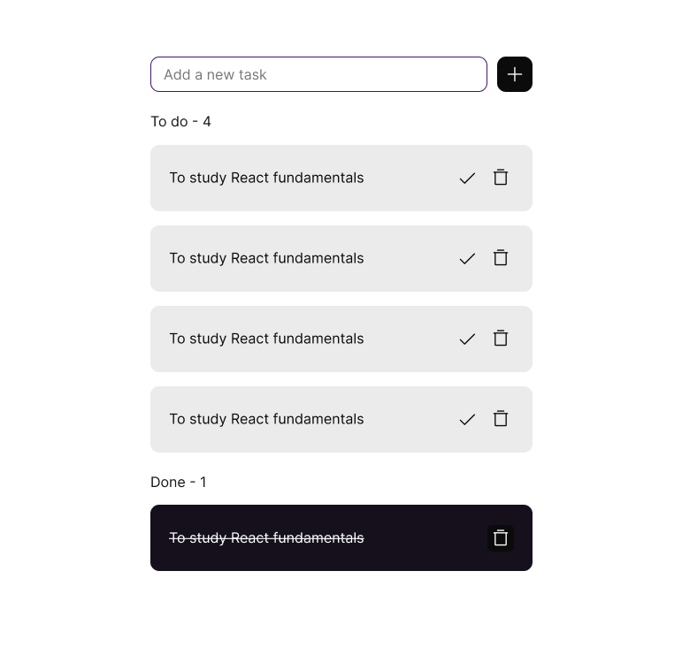
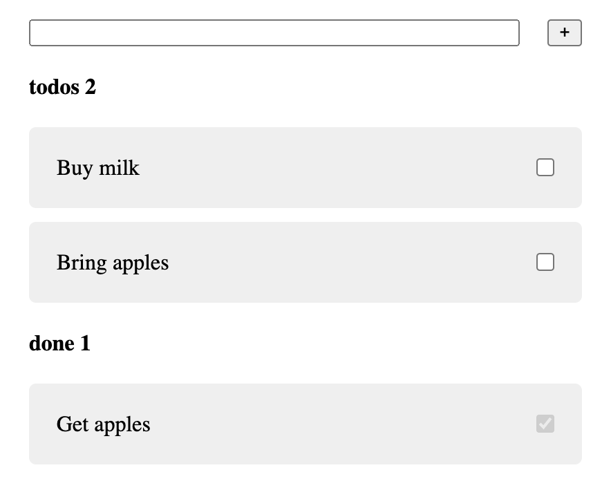

# Diasbytes interview

## Provided
- install dependencies
- run start:app to start react project: http://localhost:4500/api/todos
- run start:server to start server: http://localhost:3001

## Assignment
Create a todo app based on the design (and example) below.
Use the API the save the data to an array in memory.

